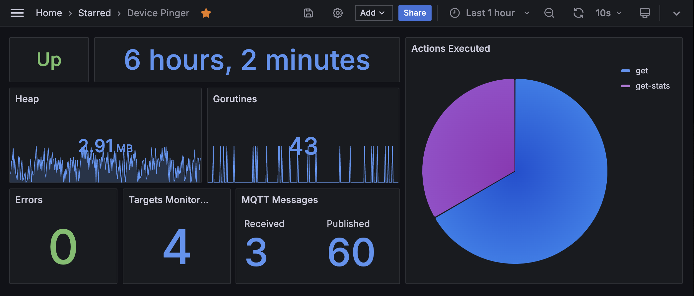
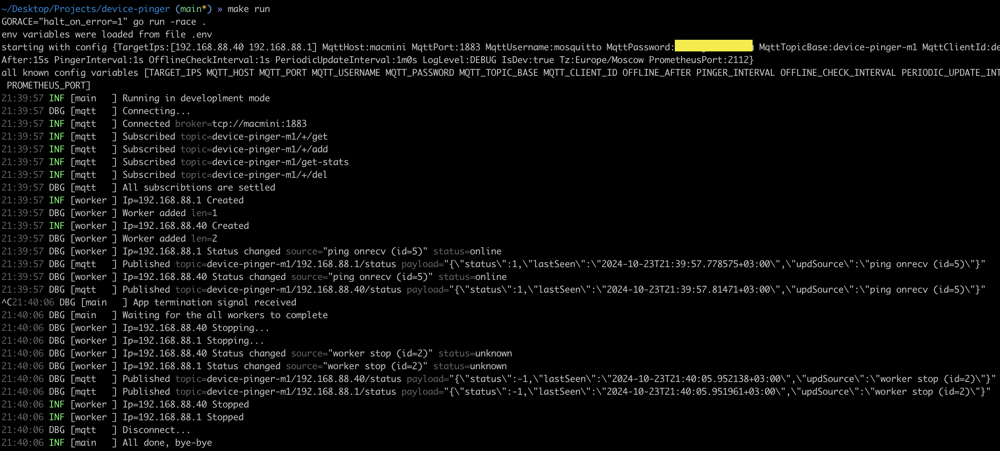

### Overview

Application performs a ping of given ip adresses and report target online/offline status via mqtt topics. Used in home automation scenarious when its required to distingush user presence/absence at home. Note than local DHCP server (on your wifi router or any other) should be configured to assign static IP adresses for the devices you going to track.

### Alternatives

- There is a similar, but looking abandoned, project based on bluetooth https://github.com/andrewjfreyer/monitor. Unfortunately, I was not able to make it running on old hardware, which is MacMini 2010 in my case (running ubuntu linux and used as home automation server).
- https://espresense.com/ - another not tested, but looking more comprehencive alternative, which requires additional hardware (esp32 microcontroller board) and its flashing.

### Mqtt Api

- To receive statuses - subscribe to `device-pinger/<ip>/status` or wildcard `device-pinger/+/status`, payload would be a json `{"status":<status>}`, with 3 possible **status** numeric values: -1 - UNKNOWN, 0 - OFFLINE and 1 - ONLINE
- Add new IP to monitor - publish to `device-pinger/<ip>/add` with empty payload or json `{"seq":<number>}` if request/response should be correlated. Operation result will be published to `device-pinger/<ip>/rsp`
- Delete IP from monitoring - publish to `device-pinger/<ip>/del` (same payload format as for **add**)
- Force request status - publish anything to `device-pinger/<ip>/get`
- REquest application stats - publish anything to `device-pinger/get-stats`

### Configuration

Configuration is set via environment variables or from .env file. There are several options: 
1. use `make docker-up` to load default .env file; 
1. use `CONF=.env.sample make docker-up` to run with selected file;
1. load envs with [docker-compose](https://github.com/fedulovivan/mhz19-next/blob/master/docker-compose.yaml) form some common config like in [.env.sample](https://github.com/fedulovivan/mhz19-next/blob/master/.env.sample) in my case;
1. pass one or more config options using bash syntax `MQTT_HOST=test.mosquitto.org ./device-pinger`

# Development

`make run` or `make && ./device-pinger` to compile and start app with default config **.env**
or you can set any other config with `CONF=.env.bak make run`
evaluate prometheus metrics in cli `curl -s http://localhost:2112/metrics | grep "pinger" | grep -v "#"`

### Production

- build image with `make docker-build`
- run image with default config `make docker-up`
- run image with any selected config `CONF=.env.sample make docker-up`

### Screenshots

Dashboard

Console

MQTT Explorer
 
Image size

