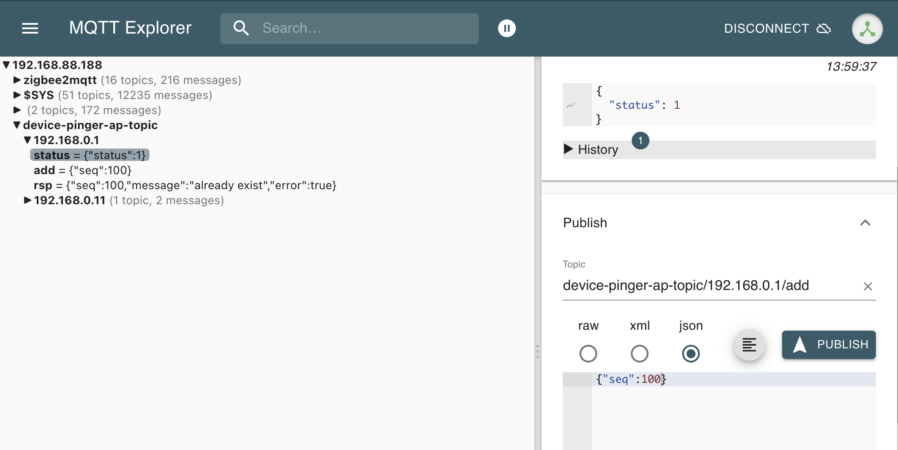

### Overview

A simple alternative to https://github.com/andrewjfreyer/monitor which I failed to setup on my old MacMini 2010. This application performs a ping of given ips and reports node online/offline status via mqtt. Used in home automation scenarious when its required to distingush user presence/absence at home.

### Mqtt Api

- To receive statuses - subscribe to `device-pinger/<ip>/status` or wildcard `device-pinger/`, payload would be `{"status":<status>}`, with 3 possible **status** values -1, 1, 0
- Add new IP to monitor - publish to `device-pinger/<ip>/add` with any payload
- Delete IP from monitoring - publish to `device-pinger/<ip>/del` with any payload

### Configuration

Configuration is set via .env files. In development file .env is always loaded. In production there several options: use `make docker-run` to load default .env file, use `CONF=.env.sample make docker-run` to run with selected file, load envs from common docker-compose config from https://github.com/fedulovivan/mhz19-next/blob/master/.env.sample

### Production

- build image with `make docker-build`
- run image with default config `make docker-run`
- run image with any selected config `CONF=.env.sample make docker-run`

### Development

- build local binary `make`
- run `make run`

### TODO

- check for memleaks
- find better way to silence certain errors in "func (l WorkerLogger) Fatalf()"
- add some basic telemetry
- find reason for the unexpected image size growth from 7.7mb to 8.1mb
- (+) integrate into main docker-compose stack
- (+) send feedback via mqtt for add/del operations
- (+) rename mqttclient to mqtt
- (+) exclude "go test" from docker-build (to avoid installing go on build host)
- (+) push changes from MacMini
- (+) skip repeating errors like "no route to host"
- (+) implement mqtt "get" action
- (+) implement periodic status updates
- (+) fixed build commad for "exec format error"
- (+) split into worker and workers
- (+) workers.lock does not utilize full power of RWMutex
- (+) application is terminated if no target IP is set or all were deleted, to be fixed.
- (+) switch to https://github.com/sethvargo/go-envconfig
- (+) send first status update right after application startup

### Screenshots

Console

MQTT Explorer
 
Image size

